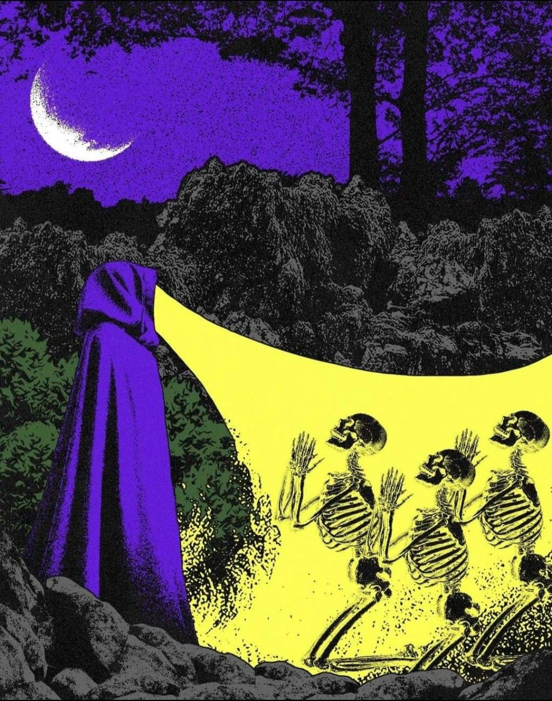
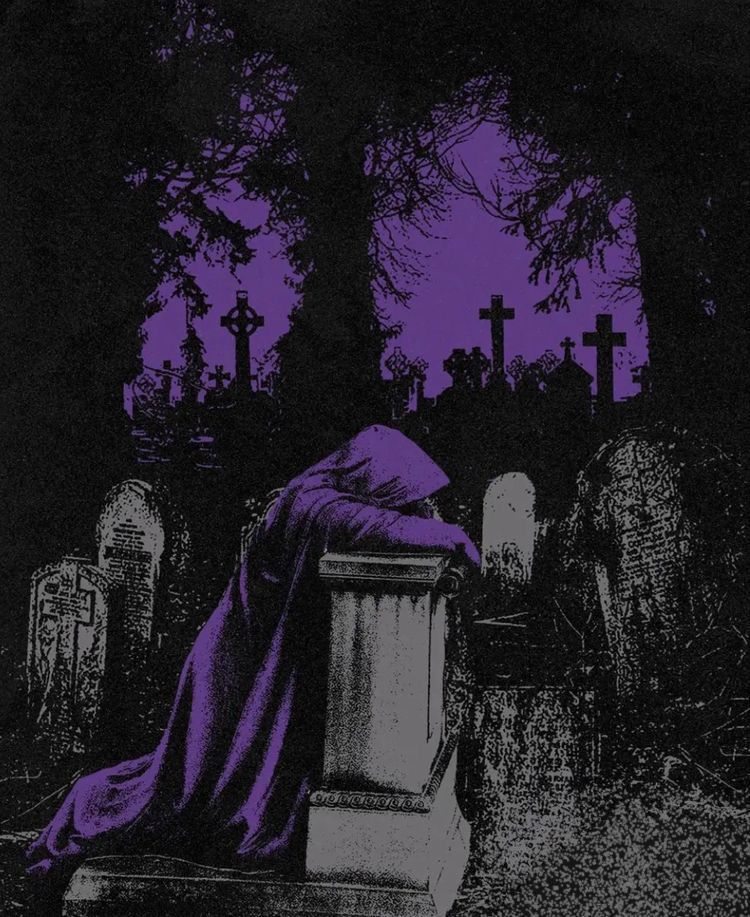
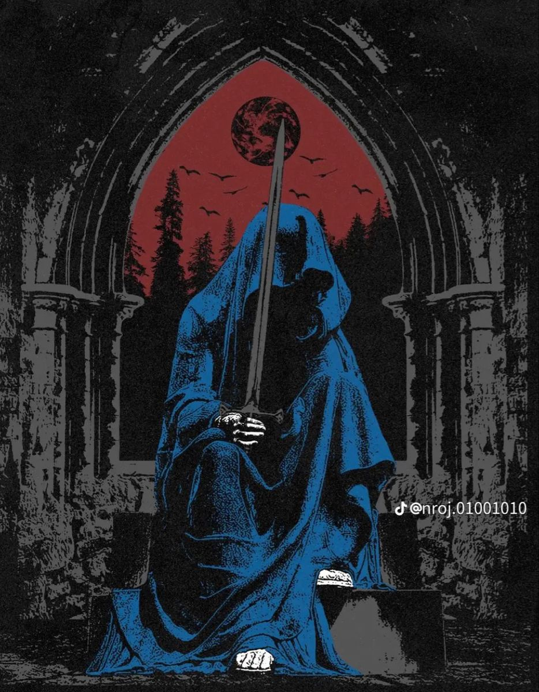
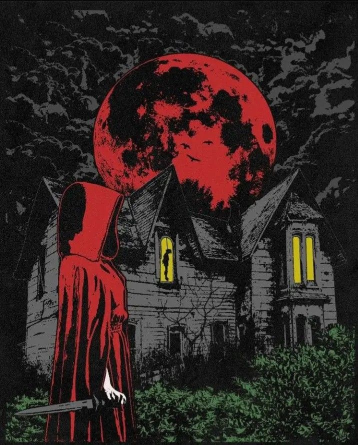

# **Night of the Killing Dead – Game Design Document**

### Genre: Roguelike • Top-Down Action • Dark Fantasy  
### Creator: William Sherry  

---

## 1. Overview

**Night of the Killing Dead** is a 2D, isometric roguelike action game where the player controls **Wolfen**, a powerful necromancer who grows from a vulnerable spellcaster to master of an immense undead legion.  

The core design revolves around:
- Rapid, high-intensity combat  
- Large-scale summoning and army control  
- The satisfying fantasy of commanding hundreds of skeletons  

Each run begins small and slow — but may end with an overwhelming undead swarm consuming the arena.

---

## 2. Core Pillars

| Pillar | Description |
|-------|-------------|
| **Necromantic Power Fantasy** | Player growth is measured in skeletons, skeleton spells, and combat scale. |
| **High-Octane Combat** | Fast, aggressive fights with constant pressure. |
| **Tactical Army Management** | Survivability relies on positioning and resurrection strategy. |
| **Dark Fantasy Horror Style** | 80s horror aesthetic, striking colours, heavy atmosphere. |

---

## 3. Player Character: Wolfen

Wolfen begins fragile, relying on basic offensive spells.  
Enemy kills offer **XP**, leveling up Wolfen and expanding his ability to command the undead.

### Player Abilities Progression
| Early Game | Mid Game | Late Game |
|------------|----------|-----------|
| Small spell kit | Mixed skeleton types | Massive army dominance |
| Minimal skeleton slots | Strategic upgrades begin | Dozens to hundreds of undead |
| Direct combat focus | Army management focus | Player becomes commander more than fighter |

**Death Condition:**  
Wolfen is killable, and with healing being rare, losing too many skeletons exposes him.  
The undead are both shield *and* weapon — they *are* the HP buffer.

---

## 4. Skeleton System

Skeletons are Wolfen’s core mechanic and primary combat resource.

### Basic Behavior
- Fight enemies independently
- If health reaches 0 → **temporary death**
- Respawn after cooldown
- No resource cost to resurrect (beyond time)

### Level-Up Choice System
Each level-up provides a strategic reward:

| Upgrade Type | Benefit | Trade-Off |
|--------------|----------|-----------|
| **Quantity** | More basic skeleton slots (e.g., +20) | Weak individually |
| **Quality**  | Unique skeleton slot (e.g., a mage)   | Only grants 1 powerful unit |

Endgame builds depend heavily on how the player balances swarm size vs special units.

---

## 5. Game Modes

### A) Roguelike Campaign *(Primary Mode)*
- Linear progression through multiple handcrafted levels
- Each level concludes with a **boss encounter or large battle**
- Short story segments before and after each stage  
  - Fully **skippable** for gameplay-focused players

### B) Endless Mode
- No narrative
- Difficulty escalates infinitely
- Designed for players chasing survival, spectacle, and score

---

## 6. Art & Visual Direction

All art is **hand-drawn in ProCreate** and imported into Unity.  
The visual identity is inspired by classic **80’s gothic horror**.

### Visual Ruleset
- **Black + White + One Accent Color per level**
  - Lvl 1 → Green accent  
  - Lvl 2 → Purple accent  
  - …each stage distinct but cohesive
- Stylized 2D sprites, tile-based environments
- Potential future upgrade: dedicated artist to enhance output quality

---

## 7. Music & Audio Identity

Sound design is deliberately theatrical, loud, and unearthly.

### Music Composition
- Fast, heavy electronic energy
- Layered with **organ + violin** for gothic atmosphere
- Interlaced with **vintage, grainy spell-chant voice recordings**

### Dynamic Character Response
- Wolfen and skeletons perform **rhythmic idle animations**
- When vocals play:
  - Wolfen chants
  - Skeletons echo as a crowd choir

### Victory Screen
After final combat in a level:
- Stats displayed
- Wolfen + his undead army posed at center screen

---

## 8. Experience Summary

**Night of the Killing Dead** delivers:
- A power curve from *helpless sorcerer → unstoppable necromancer overlord*
- High-energy combat amplified by massive undead numbers
- A visual and musical identity that feels **grim, loud, and alive with death**

The game thrives not just on winning —  
but on the satisfaction of watching the dead rise at your command.

